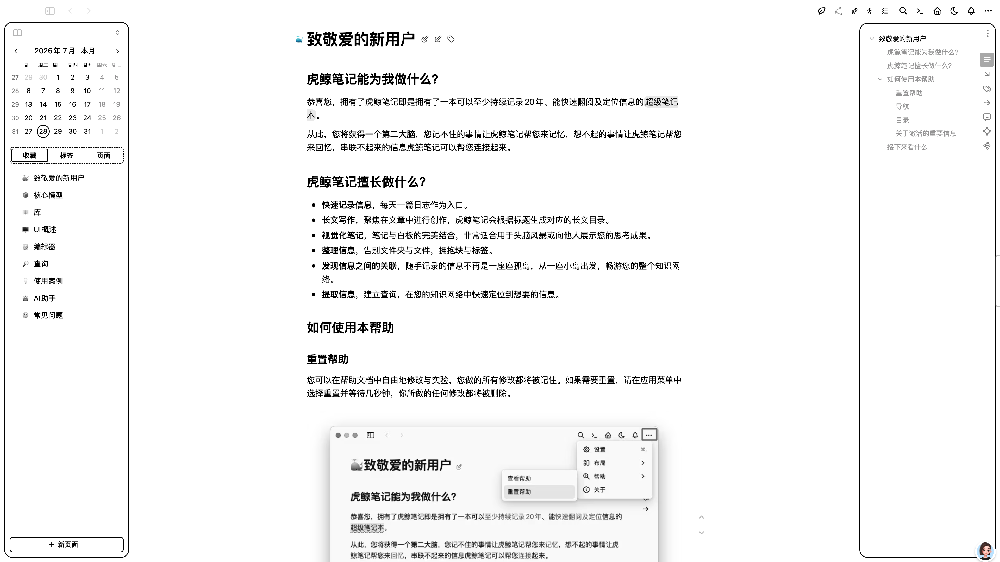
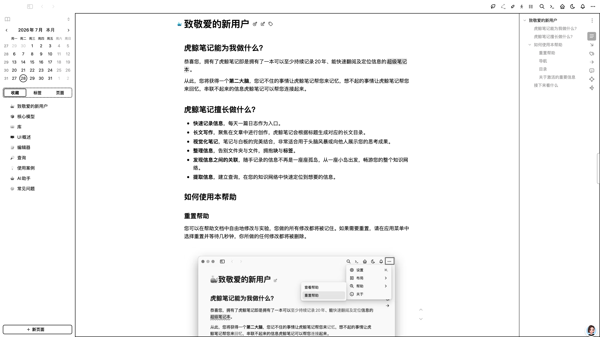
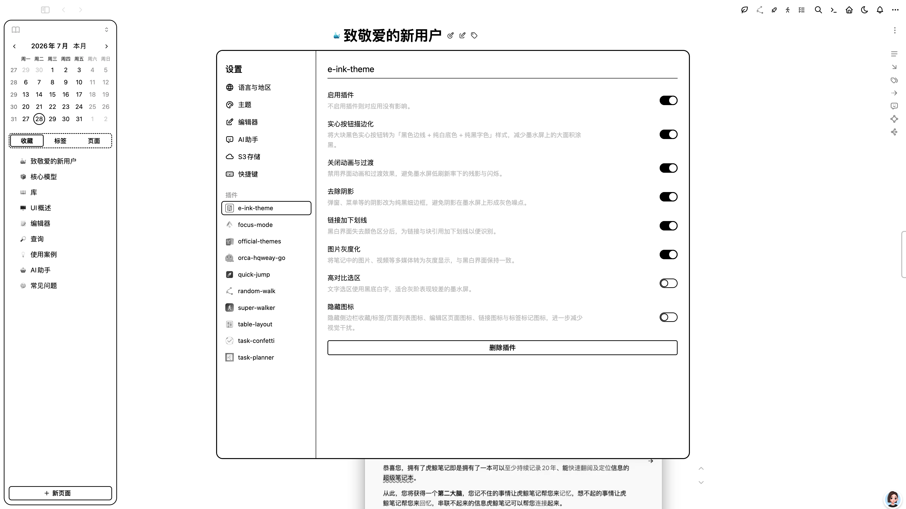

# E-Ink 黑白主题（eink-theme）

虎鲸笔记（Orca Note）纯黑白主题插件，专为**电纸书、墨水屏显示器**优化。

纯白背景、纯黑文字，所有彩色一律映射为黑白灰阶，边框与分隔线使用纯黑实线，并提供一系列针对墨水屏显示特性的可选开关（描边按钮、关闭动画、去阴影、图片灰度化等）。

## 效果预览

灵动模式：



非灵动模式：



## 特性

- **纯黑白灰阶配色**：主色、成功/警告/危险色、背景、文字、边框全部映射为黑白灰阶，无任何彩色残留
- **忽略系统深色模式**：墨水屏无深色需求，系统深色模式下同样强制白底黑字
- **主题感知开关**：所有可选样式仅在选中本主题时生效，切换到其他主题后自动移除，无副作用
- **配置实时生效**：修改插件设置后立即应用，无需重启或刷新

## 安装

1. 下载（或构建出）插件目录，放入虎鲸笔记的插件目录：

   ```
   <虎鲸笔记数据目录>/orca/plugins/eink-theme/
   ├── dist/
   │   ├── index.js
   │   ├── eink.css
   │   └── eink-toggles.css
   ├── icon.png
   └── package.json
   ```

2. 重启虎鲸笔记，在 `设置 → 插件` 中启用 **eink-theme**。

## 使用

1. 启用插件后，主题列表中会出现 **「E-Ink」** 主题；
2. 在 `设置 → 外观` 中选择该主题即可生效；
3. 在 `设置 → 插件 → eink-theme` 中按需调整下方开关项。

## 设置项



| 设置项 | 默认值 | 说明 |
| --- | :---: | --- |
| 实心按钮描边化 | ✅ 开 | 将大块黑色实心按钮转为「黑色边线 + 纯白底色 + 纯黑字色」样式，减少墨水屏上的大面积涂黑 |
| 关闭动画与过渡 | ✅ 开 | 禁用界面动画和过渡效果，避免墨水屏低刷新率下的残影与闪烁 |
| 去除阴影 | ✅ 开 | 弹窗、菜单等的阴影改为纯黑细边框，避免阴影在墨水屏上形成灰色噪点 |
| 链接加下划线 | ✅ 开 | 黑白界面失去颜色区分后，为链接与块引用加下划线以便识别 |
| 图片灰度化 | ✅ 开 | 将笔记中的图片、视频等多媒体转为灰度显示，与黑白界面保持一致 |
| 高对比选区 | ⬜ 关 | 文字选区使用黑底白字，适合灰阶表现较差的墨水屏 |
| 隐藏图标 | ⬜ 关 | 隐藏侧边栏收藏/标签/页面列表图标、编辑区页面图标、链接图标与标签标记图标，进一步减少视觉干扰 |

> 所有开关仅在选中「E-Ink」主题时生效，不会影响其他主题。

## 工作原理

- `public/eink.css`：主题样式表，通过覆盖 Orca 的 CSS 变量（`--orca-color-*`）实现全局黑白化，并在 `:root` 上设置 `--eink-theme-flag: 1` 作为主题激活标记；
- `public/eink-toggles.css`：各开关对应的样式规则，以 body class（如 `eink-no-anim`）作用域限定；
- `src/main.ts`：插件入口。注册主题、注入开关样式表，通过 Valtio 订阅设置变更、通过 `MutationObserver` 监听 `<head>` 变化感知主题切换，按「主题是否激活 + 开关设置」同步 body class；
- `src/settings.ts`：定义设置项 Schema 与配置读取逻辑。

## 开发

```bash
# 安装依赖
npm install

# 开发模式（监听变更自动构建）
npm run dev

# 构建
npm run build
```

构建产物输出到 `dist/` 目录（`public/` 下的 CSS 文件会随构建一并复制）。开发时可将本项目目录软链接到虎鲸笔记的插件目录进行调试。

## 项目结构

```
e-ink-theme/
├── public/
│   ├── eink.css           # 主题样式表（CSS 变量黑白化）
│   └── eink-toggles.css   # 可选开关样式（body class 作用域）
├── src/
│   ├── main.ts            # 插件入口：主题注册与开关应用
│   ├── settings.ts        # 设置 Schema 与配置读取
│   └── orca.d.ts          # Orca 插件 API 类型声明
├── icon.png               # 插件图标
├── vite.config.js         # 构建配置（ES 模块，输出 dist/index.js）
└── package.json
```

## License

[MIT](./LICENSE)
